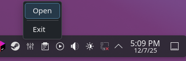
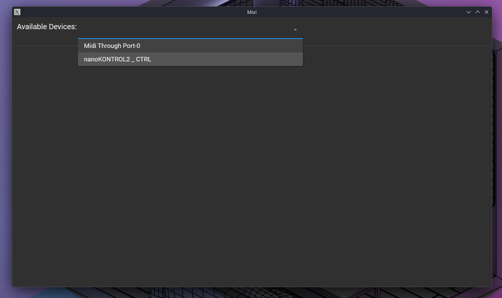
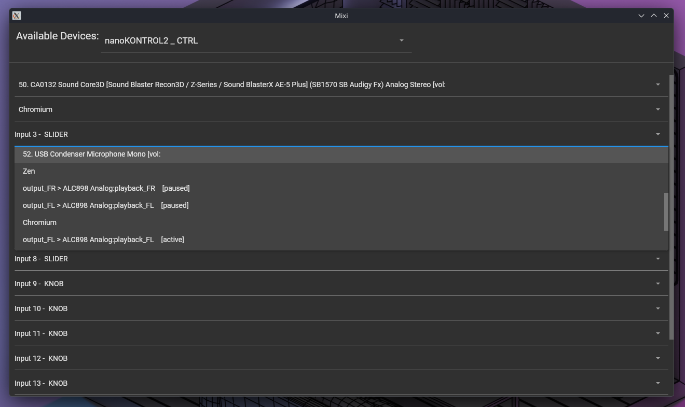

## Mixi Audo Manager

A cross-platform midi controller audio manager. Heavily inspired by [midi mixer](https://www.midi-mixer.com/) by Jack
Williams.

Originally practice for learning C#, this project was open sourced to allow for future expansion for better cross
platform support as well as better support for more midi devices.

This application was explicitly designed to be scalable for new devices and audio interfaces for different platforms.

### Screenshots

### Planned features

- [ ] Working UI using Avalonia for cross platform support
    - [x] Taskbar "service"
    - [x] Midi control window
    - [ ] Save/load for UI
    - [ ] Device Profiles
    - [ ] Polish
- [x] Audio abstraction layer
- [ ] OS Audio interface layers
    - [ ] Linux (Needs to include a few different implementations such as pulse audio, pipewire, etc)
    - [ ] Windows
    - [ ] MacOs
- [ ] Midi device support
    - [x] Korg Nano Kontrol 2
    - Need to expand list or figure out a way to generically fetch infromation from midi devices